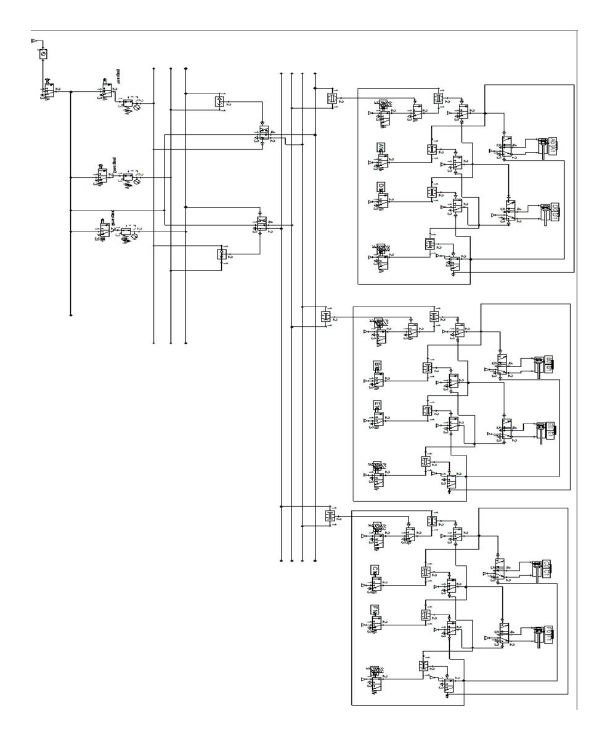

# Pneumatic Tube System Automation

## Overview
This project is my undergraduate work at Çukurova University, Mechanical Engineering Department. It designs a **fully automated pneumatic tube system** to transport medical samples (like blood and urine) in hospitals. The system uses compressed air, special carriers, and conveyors to move samples quickly and safely without human help. It was supervised by **Prof. Dr. Necdet Geren** and submitted on **January 26, 2024**.

## Objective
To create an automated system that transports medical samples faster, safer, and with fewer errors, reducing delays and nurse workload in hospitals.

## Methodology
- **Design**: Tubes made of PVC, carriers made of borosilicate glass and polyurethane for safety and durability.
- **Actuators**: Six DSNU pistons (25 mm diameter) to move stations and grip conveyors.
- **Conveyor**: D-Series conveyor for smooth transport.
- **Blower**: SANYO DENKI blower for air flow (0.78 m³/min).
- **Control**: Automated with a pressure control valve and program logic.
- **Tools**: CAD for design, calculations for actuator sizing and air use.

## Key Features
- **System Layout**:  
    
  *Shows how tubes, actuators, and conveyors work together.*
- **Program Flow**:  
    
  *Shows the automation steps.*
- **Carrier Design**:
- 
    
  *Borosilicate glass and polyurethane for sample safety.*
  - **Series Function Chart**:  
    
  *Shows the control sequence for actuators.*
- **Step Counter Chart**:  
    
  *Shows the step-by-step automation process.*

## Results
- **Efficiency**: Faster sample delivery with no human errors.
- **Safety**: Strong materials and emergency stop button protect samples.
- **Use Case**: Ideal for large hospitals to save time and reduce nurse workload.

## Report
- [Full Report](pneumatic_tube_automation.pdf)  
  *Full details of the project.*

## Files
